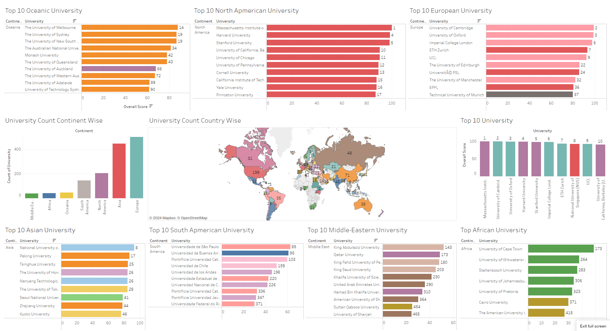

# QS-TOP-UNIVERSITY-RANKING-WEBSITE-DATA-SCRAPER

Hello good people!
This project is uses Selenium to scrape data from a dynamic website : https://www.topuniversities.com/world-university-rankings/2024

**It is done for educational perpose only**

End result to keep you hooked :P

Visit this [link](https://public.tableau.com/app/profile/syed.mohammed.mostaque.billah/viz/QSTopUniversityRankContinentWiseView/QSTop10UniversityinContinents) for interactable dashboard.

# Motive

1. Scrape and collect data of University Ranking from this [link](https://www.topuniversities.com/world-university-rankings/2024).
2. Transform the data into csv file.
3. Visulize the dataset using Tableau.
4. Find a story using the dashboad.

# Data collection

**_Data consist of every university rank, name , location, points from 2018 to 2022. Not only that, inside of each university, their latest information is also collected._**

You can run this code and collect datasets. Thus you can build your own tableau Dashboard. To do this you have to follow these instructions.

1. Download [Google Chrome Driver](https://googlechromelabs.github.io/chrome-for-testing/) from based on your device:  
   unzip the downloaded file and collect the path where The Driver is saved.

2. Install Python on your device from [Here](https://www.python.org/downloads/)

3. Download this [Folder](https://github.com/MostaqueBillah/qs-ranking-university-2024-data-scraper) file, unzip the downloaded file, And Rename the file name.

4. (Optional) Create an environment for this project inside of the unzipped file. Click right button of mouse and select **Open in Terminal** and write these code one by one

```
Set-ExecutionPolicy Unrestricted
```

```
pip install virtualenv
or
pip3 install virtualenv
```

```
virtualenv env
```

```
myenv\Scripts\activate
```

5. Then in the terminal write

```
pip install -r requirements.txt
or
pip3 install -r requirements.txt
```

6. After Completing install packages, write

```
cd scripts
```

Hit Enter

7. Then Write

```
python scraper.py
```

8. Hit Enter and Wait for 3 hours, Please Do not Touch Anything.

9. **(Optional)** After the first script you might run another script that will generate anothoer csv file.

```
python modify_csv.py
```

10. This will create another file which will include additional ranking based on every parameters. However in this project it will **not be necessary!**

**_After Completing all of works You'll get an Outputs in csv Format_**

# Analysis and Stories:

<!--
 -->


Visit this [link](https://public.tableau.com/app/profile/syed.mohammed.mostaque.billah/viz/QSTopUniversityRankContinentWiseView/QSTop10UniversityinContinents) for interactable dashboard.

## Story or Findings:

    The picture dashboard contains:
        1. Top 10 university world-wide
        2. A world map containg total top university count that has been listed on QS world ranking websites
        3. University count from the list by each continent
        4. top 10 University of each continent.


Visit this [link](https://public.tableau.com/app/profile/syed.mohammed.mostaque.billah/viz/ImpactofdifferentParametersinQSUniversityRanking/ImpactofdifferentParametersinQSUniversityRanking) for interactable dashboard.

## Story or Findings:

    The picture dashboard contains:
        1. Rank vs Citation Per Faculty:
        2. Rank vs Academic Reputaion:
        3. Rank vs Employer Reputaions:
                vs Employee Outcomes:
        4. Rank vs International Faculty Ratio:
                vs International Student Ratio:
                vs Reasearch Network:
        5.Rank vs Faculty Student Ratio:
